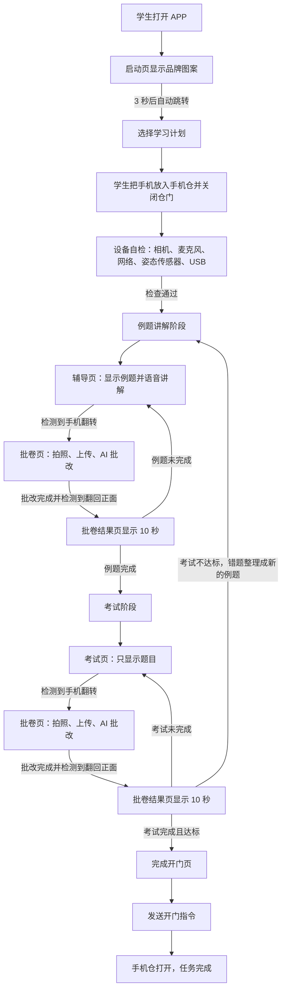

# 使用流程

面向对象：小白用户、外行人、投资人。  
一句话：这是一个“手机锁进学习仓后，靠语音和翻转动作完成学习、判卷、考试，达标后开门”的 Android APP。

## 核心体验

## 关键规则

- 手机锁进仓后，学生不能触摸屏幕。
- 学习计划选择页是唯一主要触控页面。
- 设备自检页之后，只靠语音提示、文字提示、手机翻转推进。
- 考试不达标时，错题会整理成新的例题，回到例题讲解阶段。
- 考试页只显示题目，不显示讲解和答案。
- 批卷页统一负责拍照、上传、AI 批改。
- 批卷完成后，APP 语音和文字提示学生把手机翻回正面。
- 批卷结果页停留 10 秒后自动进入下一步。
- 异常只在当前页面显示提示层，不单独做异常页。

## MVP 边界

- 先只做 Android。
- 先固定一种 USB 手机仓硬件。
- 先固定一套题目流程：例题讲解、考试、不达标后错题转例题。
- 先跑通完整闭环，再扩展防作弊、门磁反馈、复杂后台。
