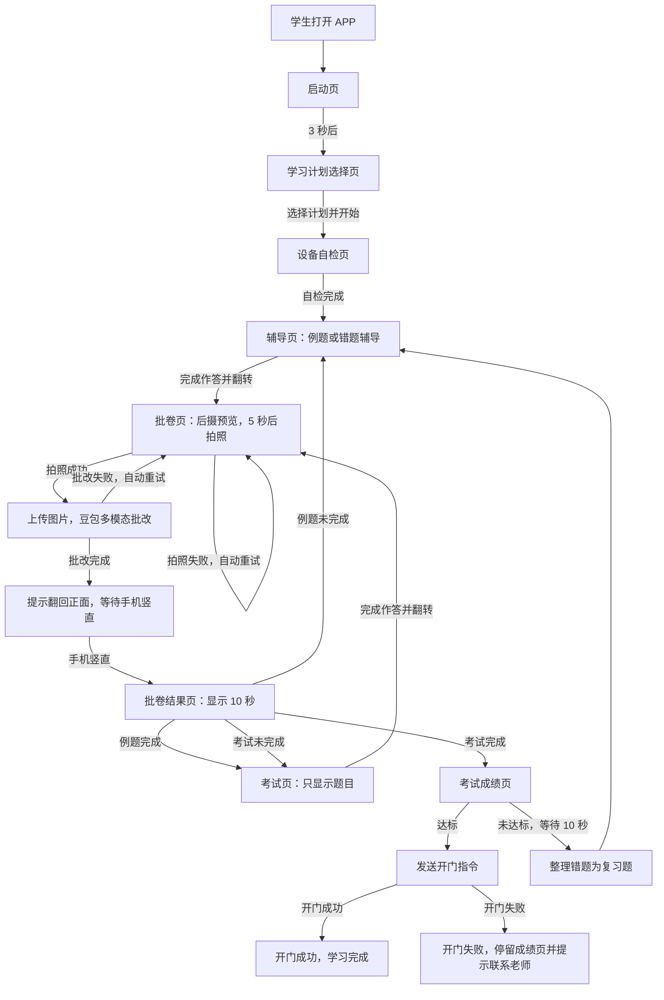

# 使用流程

面向对象：小白用户、外行人、投资人。  
一句话：这是一个“手机锁进学习仓后，靠语音和翻转动作完成学习、判卷、考试，达标后开门”的 Android APP。

## 核心体验

```mermaid
graph TD
    app_open["学生打开 APP"]
    start_page["启动页"]
    plan_page["学习计划选择页"]
    self_check_page["设备自检页"]

    tutoring_page["辅导页：例题或错题辅导"]
    exam_page["考试页：只显示题目"]
    grading_prepare["批卷页：后摄预览，5 秒后拍照"]
    grading_ai["上传图片，豆包多模态批改"]
    wait_upright["提示翻回正面，等待手机竖直"]
    result_page["批卷结果页：显示 10 秒"]

    score_page["考试成绩页"]
    door_open["发送开门指令"]
    door_opened["开门成功，学习完成"]
    door_failed["开门失败，停留成绩页并提示联系老师"]
    mistake_review["整理错题为复习题"]

    app_open --> start_page
    start_page -->|3 秒后| plan_page
    plan_page -->|选择计划并开始| self_check_page
    self_check_page -->|自检完成| tutoring_page

    tutoring_page -->|完成作答并翻转| grading_prepare
    exam_page -->|完成作答并翻转| grading_prepare
    grading_prepare -->|拍照成功| grading_ai
    grading_prepare -->|拍照失败，自动重试| grading_prepare
    grading_ai -->|批改失败，自动重试| grading_prepare
    grading_ai -->|批改完成| wait_upright
    wait_upright -->|手机竖直| result_page

    result_page -->|例题未完成| tutoring_page
    result_page -->|例题完成| exam_page
    result_page -->|考试未完成| exam_page
    result_page -->|考试完成| score_page

    score_page -->|达标| door_open
    door_open -->|开门成功| door_opened
    door_open -->|开门失败| door_failed
    score_page -->|未达标，等待 10 秒| mistake_review
    mistake_review --> tutoring_page
```

## 关键规则

- 手机锁进仓后，学生不能触摸屏幕。
- 学习计划选择页是唯一主要触控页面。
- 设备自检页之后，只靠语音提示、文字提示、手机翻转推进。
- 辅导页和考试页检测到 `a_z > 7` 稳定 3 秒后进入批卷页。
- 批卷完成后检测到手机竖直，也就是 `|a_z| < 2` 后进入批卷结果页。
- 每道考试题满分为 `100 / 本轮考试题目数量`，考试总分为各题得分相加，不取平均分。
- 考试中未拿到本题满分的题视为错题，会整理成复习题回到辅导页；错题辅导完成后只重考这些错题。
- 考试页只显示题目，不显示讲解和答案。
- 批卷页显示后置摄像头预览，进入页面后等待 5 秒自动拍照，再上传给豆包多模态批改。
- 批卷完成后，APP 语音和文字提示学生把手机翻回正面。
- 批卷结果页停留 10 秒后自动进入下一步。
- 考试成绩页按学习计划 `passScore` 判断达标；总分达到 `passScore` 时发送开门指令，未达到时 10 秒后进入错题辅导。
- 当前没有真实开门硬件配置时，开门服务会返回失败并停留在考试成绩页显示提示。
- 异常只在当前页面显示提示层，不单独做异常页。

## MVP 边界

- 先只做 Android。
- 先固定一种 USB 手机仓硬件。
- 先固定一套题目流程：例题讲解、考试、不达标后错题转例题。
- 先跑通完整闭环，再扩展防作弊、门磁反馈、复杂后台。
